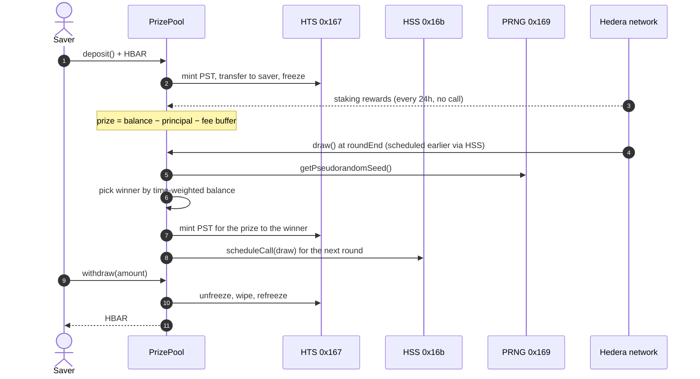

# Prize Savings: no-loss prize savings on Hedera

Deposit HBAR, never lose it, and win the yield it earns. Every round, the pool's **native staking rewards** (plus any
sponsor boosts) go to one depositor, picked by **Hedera's PRNG** in a draw that the contract **schedules for itself**
with the **Hedera Schedule Service**. Deposits are mirrored as **non-transferable HTS tickets**.

```bash
npm create scaffold-hbar@latest -- --template nickthelegend/scaffold-hbar-prize-savings
```

| | |
|---|---|
| Live pool (testnet) | see [Testnet proof](#testnet-proof) |
| Stack | Next.js App Router · RainbowKit/wagmi/viem · Foundry · Hiero SDK · Yarn workspaces |
| Hedera services | Staking · Schedule Service (HIP-1215) · PRNG (HIP-351) · Token Service · Mirror Node |

This is the prize-linked-savings pattern (PoolTogether, UK Premium Bonds). On most EVM chains it needs a yield
protocol, a VRF oracle and a keeper network. On Hedera all three are part of the network, which is what this template
shows you how to use.

---

## Contents

1. [Quickstart](#quickstart)
2. [Deploy your own pool](#deploy-your-own-pool)
3. [How it works](#how-it-works)
4. [Hedera services, and where they live in the code](#hedera-services-and-where-they-live-in-the-code)
5. [Project layout](#project-layout)
6. [Contract reference](#contract-reference)
7. [Costs and sizing](#costs-and-sizing)
8. [Security model and limitations](#security-model-and-limitations)
9. [Testing](#testing)
10. [Configuration](#configuration)
11. [Hedera gotchas this template handles](#hedera-gotchas-this-template-handles)
12. [Testnet proof](#testnet-proof)
13. [Working with AI agents](#working-with-ai-agents)

---

## Quickstart

### Prerequisites

| Tool | Version | Notes |
|---|---|---|
| Node.js | ≥ 20.18.3 | `node -v` |
| Yarn | 3 (bundled) | `corepack enable` once; the repo pins Yarn 3.2.3 in `.yarn/releases`. The template is Yarn-only: with npm, scaffold-hbar's install-time formatter and unpinned wagmi connectors break the build |
| Foundry | latest | `curl -L https://foundry.paradigm.xyz \| bash && foundryup` (only needed for contracts) |
| Git | any | the CLI makes an initial commit |
| Wallet | MetaMask or any EVM wallet | or use the built-in burner wallet |

### Run the app against the live testnet pool

The scaffold ships with the address of a PrizePool already running on Hedera testnet
(`packages/nextjs/contracts/deployedContracts.ts`), so you can use it before deploying anything:

```bash
npm create scaffold-hbar@latest -- --template nickthelegend/scaffold-hbar-prize-savings
cd my-hedera-dapp
yarn next:dev            # http://localhost:3000
```

1. Connect a wallet on **Hedera Testnet** (chain id 296), or use the burner wallet.
2. Get free testnet HBAR at <https://portal.hedera.com/faucet>. Funding an EVM address also creates its Hedera account.
3. Deposit at least 1 HBAR. You receive the same amount of **PST** tickets, frozen in your account.
4. Watch the countdown. When the round ends, the network runs the draw scheduled by the contract itself. The result
   appears under **Past draws** with a HashScan link.
5. Withdraw any part of your deposit at any time.

Routes: `/` (pool), `/how-it-works` (explainer), `/debug` (every contract function), `/api/health` (JSON health check).

## Deploy your own pool

```bash
yarn foundry:test                      # ledger unit, fuzz and invariant tests
yarn foundry:account:generate          # creates a Foundry keystore; fund its address at the faucet
yarn foundry:compile
yarn foundry:deploy --network testnet  # --keystore <name> --node <id> are optional
```

`foundry:deploy` runs [`packages/foundry/scripts-js/deployPrizePool.js`](packages/foundry/scripts-js/deployPrizePool.js),
which:

1. creates the contract with **`ContractCreateFlow`**, a staking election (`setStakedNodeId`) and **no admin key**;
2. calls `initialize()` with HBAR for the HTS token-creation fee, which creates the PST ticket token and schedules
   the first draw;
3. sends a small seed with `boostPrize()` that pays for the first scheduled draws;
4. writes the address and ABI to `packages/nextjs/contracts/deployedContracts.ts`, which the frontend reads.

Why not `forge script`? Only the HAPI `ContractCreate` transaction can set a staking election. A contract deployed
over JSON-RPC has none, and because this one deliberately has no admin key, it could never get one later.

Tune a deployment with env vars (in `packages/foundry/.env` or inline):

```bash
ROUND_SECONDS=21600 KEEPER_SEED_HBAR=20 yarn foundry:deploy --network testnet --node 5
```

## How it works



### Where the prize comes from

The contract holds every deposit as plain HBAR and is **staked to a consensus node**. Hedera pays staking rewards to
the contract's balance once per 24-hour staking period, the next time the account is touched, with no claim call.
Anyone can also **boost** the prize: that HBAR earns no odds and cannot be withdrawn.

```
prize = address(this).balance − totalPrincipal − keeperBuffer
```

Scheduled draws are paid by the contract itself, so their fees come out of the surplus first. `keeperBuffer` keeps a
reserve for those fees.

### Fair odds: balance × time

A saver's weight in a round is the integral of their balance over the round's seconds. Depositing 10 HBAR at the start
of a round gives twice the weight of depositing 10 HBAR halfway through, and a deposit one second before the end is
worth almost nothing. That stops anyone sniping the draw.

The contract keeps this cheap with lazy accounting (`_accrue`). Each account stores `(balance, lastUpdated, round,
weight)`, settled only when its balance changes. For an account untouched this round, the weight is simply
`balance × roundDuration`.

### The draw

`draw()` sums every participant's projected weight, takes `keccak256(prngSeed, round) % totalWeight`, and walks the
cumulative weights to the winner. The prize is **added to the winner's deposit** (with new tickets), not sent out, so a
draw can never fail because of a wallet. Then the next round opens and the next draw is scheduled.

If the scheduled call doesn't run (no capacity, or the fee reserve ran out), **anyone** can call `draw()` once
`drawGrace` has passed. The UI shows a "Trigger draw" button in that case.

## Hedera services, and where they live in the code

| Service | What it does here | Code |
|---|---|---|
| **Staking** | Deposits earn network rewards with zero protocol risk | [`deployPrizePool.js`](packages/foundry/scripts-js/deployPrizePool.js) `setStakedNodeId` |
| **Schedule Service** (HIP-1215, `0x16b`) | The contract schedules its own next `draw()`; there's no keeper bot | [`PrizePool._scheduleDraw`](packages/foundry/contracts/PrizePool.sol) |
| **PRNG** (HIP-351, `0x169`) | Random winner from a consensus-derived seed; there's no VRF subscription | [`PrizePool.draw`](packages/foundry/contracts/PrizePool.sol) |
| **Token Service** (`0x167`) | PST ticket token: the contract holds the supply, freeze and wipe keys; holdings are frozen so they can't be transferred | [`PrizePool._createTicket` / `_issueTickets` / `_burnTickets`](packages/foundry/contracts/PrizePool.sol) |
| **Token association** (HIP-719) | UI checks whether the wallet must call `associate()` on the ticket token before its first deposit | [`useTicketAssociation`](packages/nextjs/hooks/prize-savings/useTicketAssociation.ts) |
| **Mirror Node** | Draw history, staking status, schedule entities and associations, with no indexer | [`utils/prize-savings/mirror.ts`](packages/nextjs/utils/prize-savings/mirror.ts) |

## Project layout

```
packages/
├── foundry/
│   ├── contracts/
│   │   ├── PrizePool.sol                 # Hedera wiring: HTS tickets, HSS scheduling, PRNG draw
│   │   ├── PrizeLedger.sol               # pure bookkeeping: principal, rounds, time-weighted odds
│   │   └── interfaces/                   # HTS, HSS and PRNG system-contract interfaces
│   ├── scripts-js/
│   │   ├── deployPrizePool.js            # `yarn foundry:deploy`
│   │   └── lib/                          # network config + SDK deployment (shared with the e2e suite)
│   └── test/
│       ├── PrizeLedger.t.sol             # unit + fuzz tests of the ledger
│       ├── PrizeLedger.invariant.t.sol   # invariants under random sequences
│       └── e2e/prizePool.e2e.test.js     # full round on a real Hedera network
└── nextjs/
    ├── app/                              # / (pool), /how-it-works, /debug, /api/health
    ├── components/prize-savings/         # PrizeHero, SavePanel, PositionCard, DrawHistory, StakingCard
    ├── hooks/prize-savings/              # contract reads, mirror-node queries, countdown
    └── utils/prize-savings/              # unit conversion, entity ids, mirror client (+ tests)
```

## Contract reference

| Function | Who | What |
|---|---|---|
| `initialize()` payable | deployer, once | Creates the PST ticket token (the value pays the HTS fee), opens round 1, schedules its draw |
| `deposit()` payable | anyone | Adds `msg.value` to your principal and mints frozen tickets. Min `minDeposit`, max `maxParticipants` savers |
| `withdraw(uint256)` | saver | Returns principal at any time, burning tickets |
| `boostPrize()` payable / `receive()` | anyone | Adds to the prize without odds |
| `draw()` | HSS schedule at `roundEnd`; anyone after `roundEnd + drawGrace` | Picks the winner or rolls over, opens the next round, schedules the next draw |
| `prize()` view | | Current prize in tinybars |
| `accountOf(address)` view | | `(balance, projectedWeight)` |
| `oddsOf(address)` view | | `(userWeight, totalWeight)` projected to the round's end |

Events: `Deposited`, `Withdrawn`, `PrizeBoosted`, `DrawExecuted(round, winner, prize, seed, participants)`,
`RoundRolledOver`, `DrawScheduled(round, schedule, expirySecond)`, `ScheduleFailed(round, responseCode)`.
All amounts are **tinybars** (see [gotchas](#hedera-gotchas-this-template-handles)).

## Costs and sizing

| Item | Measured on a real network (gas price 89 tinybar/gas, HBAR ≈ $0.10) |
|---|---|
| Deploy (`ContractCreateFlow`) | ≈ 15–20 HBAR |
| Ticket token creation (`initialize` value) | ≈ 10 HBAR ($1 HTS fee) |
| Deposit or withdraw | ≈ 0.9M gas: HTS mint/transfer/freeze (or unfreeze/wipe) dominate, ≈ 0.8–1 HBAR in fees |
| One scheduled draw | `DRAW_GAS_LIMIT` (default 3M) × ≥ 80% × gas price ≈ **2.1 HBAR**, paid by the pool from surplus |
| Weight scan | ≈ 5.5k gas per saver on top of the HTS and HSS calls |

Hedera charges a contract call at least 80% of its gas limit, so `DRAW_GAS_LIMIT` is a cost knob as well as a safety
knob. HTS system-contract calls are priced from their HAPI fees, which makes them far more expensive in gas than plain
EVM storage. A draw that mints tickets for the winner, re-freezes them and schedules the next draw needs well over
1M gas. The 3M default leaves room for 100 savers.

**Round length.** Staking rewards arrive once per 24-hour period, so rounds shorter than a day mostly roll over and
spend fees. The default is 24 hours; the public testnet demo uses shorter rounds so visitors can watch draws happen.
Testnet pays about 0.19% a year in staking rewards (`/api/v1/network/stake`), so testnet prizes come mostly from
boosts. Mainnet rates are higher.

## Security model and limitations

- **No owner.** No admin key, no `onlyOwner`, no pause. After `initialize`, nobody can change parameters or touch
  principal. Deposits leave the contract only through `withdraw` to their owner.
- **No external protocol risk.** Principal is native HBAR in the contract. Compare Bonzo Lend: drained via an oracle
  flaw in July 2026, then paused.
- **Invariants.** Σ balances = `totalPrincipal` and participants = holders are fuzzed in
  `PrizeLedger.invariant.t.sol`. `balance ≥ totalPrincipal` holds by construction: principal never leaves except
  through `withdraw`, and fees only come out of the surplus. Frozen 1:1 tickets are checked end to end on a real
  network.
- **Reentrancy.** All state-changing entry points are `nonReentrant`, and `withdraw` updates the ledger and burns
  tickets before sending HBAR (checks-effects-interactions).
- **Randomness.** PRNG output can't be predicted before consensus, but it is not a VRF. Fine for small prizes; for
  large ones, add commit-reveal or a VRF provider.
- **Participant cap.** `draw()` is O(savers). The cap keeps it within the scheduled gas limit. For thousands of savers,
  replace the scan with a sortition sum tree.
- **Staking rewards** are paid by the network's reward account and may vary or pause. The pool degrades gracefully:
  rounds roll over until there is a prize.

## Testing

No simulated system contracts anywhere: logic that doesn't touch Hedera is tested in isolation, and everything
that does is tested on a real Hedera network.

| Layer | Command | What it proves |
|---|---|---|
| Ledger unit + fuzz | `yarn foundry:test` | Principal accounting, participant cap, swap-and-pop, time-weighted odds, winner selection matches odds over 2,000 draws |
| Ledger invariants | `yarn foundry:test` | 256 runs × 500 random calls: Σ balances = principal, participants = holders, untouched savers weigh exactly `balance × round` |
| Frontend | `yarn next:test` | Tinybar/weibar conversion, entity ids, mirror-node decoding, explorer links |
| **End-to-end** | `yarn foundry:test:e2e` | Deploys a staked pool with 30 s rounds and plays a full round with two savers: frozen tickets, refused ticket transfer, the **network-executed** HSS draw, PRNG winner, prize credit, withdrawals that wipe tickets |

`PrizePool` is split so this works: `PrizeLedger` holds all the bookkeeping and calls nothing, so Foundry can test
it directly. `PrizePool` only adds the HTS, HSS and PRNG calls, which only exist on Hedera.

### Running the end-to-end suite

Against a [Hiero Local Node](https://github.com/hiero-ledger/hiero-local-node) (Docker, prefunded accounts, real
system contracts):

```bash
npx @hashgraph/hedera-local start -d     # consensus node + mirror node + JSON-RPC relay
yarn foundry:compile && yarn foundry:test:e2e
```

Against testnet (needs an ECDSA operator with about 80 HBAR: deployment, ticket token, two funded savers):

```bash
E2E_NETWORK=testnet HEDERA_OPERATOR_ID=0.0.x HEDERA_OPERATOR_KEY=0x... yarn foundry:test:e2e
```

CI runs the unit tests, lint, types and build on every push, then the end-to-end suite on a local node
(`.github/workflows/ci.yaml`).

### Local development network

`yarn foundry:deploy --network local` deploys to a running local node (genesis operator, no faucet needed), and
`NEXT_PUBLIC_HEDERA_NETWORK=local yarn next:dev` points the frontend at it (chain 298, mirror node on
`localhost:5551`).

## Configuration

| Variable | Where | Default | Purpose |
|---|---|---|---|
| `ETH_KEYSTORE_ACCOUNT` | `packages/foundry/.env` | prompt | Keystore used by `foundry:deploy` |
| `DEPLOYER_KEYSTORE_PASSWORD` | shell | prompt | Non-interactive deploys (CI) |
| `ROUND_SECONDS` | deploy env | `86400` | Round length |
| `DRAW_GRACE_SECONDS` | deploy env | `600` | Delay before anyone may trigger a missed draw |
| `KEEPER_BUFFER_HBAR` | deploy env | `5` | Surplus reserved for schedule fees |
| `MIN_DEPOSIT_HBAR` | deploy env | `1` | Minimum deposit (limits dust savers) |
| `MAX_PARTICIPANTS` | deploy env | `100` | Cap that bounds draw gas |
| `DRAW_GAS_LIMIT` | deploy env | `3000000` | Gas for each scheduled draw |
| `TICKET_FEE_HBAR` | deploy env | `15` | Value sent to `initialize` for the HTS creation fee |
| `KEEPER_SEED_HBAR` | deploy env | `10` | Initial boost that pays the first scheduled draws |
| `NEXT_PUBLIC_HEDERA_TESTNET_RPC_URL` | `packages/nextjs/.env.local` | Hashio | JSON-RPC endpoint |
| `NEXT_PUBLIC_WALLET_CONNECT_PROJECT_ID` | `packages/nextjs/.env.local` | demo id | WalletConnect |
| `NEXT_PUBLIC_HEDERA_NETWORK` | `packages/nextjs/.env.local` | `testnet` | `local` targets a Hiero Local Node |
| `E2E_NETWORK` | shell | `local` | Network for `foundry:test:e2e` (`local` or `testnet`) |

No secret is read by the frontend. Never commit `.env` files; they are git-ignored.

## Hedera gotchas this template handles

1. **Two HBAR units.** Inside contracts, `msg.value` and balances are **tinybars (8 decimals)**. Over JSON-RPC,
   wallets send **weibars (18 decimals)**. The frontend sends `parseEther(amount)` as `value` and formats contract reads
   with 8 decimals ([`units.ts`](packages/nextjs/utils/prize-savings/units.ts)).
2. **Staking elections need HAPI.** See [Deploy your own pool](#deploy-your-own-pool).
3. **Token association.** An account must be associated with an HTS token before receiving it. EVM-alias accounts
   usually auto-associate. If not, the UI offers a one-click `associate()` (HIP-719) before the first deposit.
4. **Wiping frozen holdings fails** (`ACCOUNT_FROZEN_FOR_TOKEN`), so `withdraw` unfreezes, wipes and refreezes.
5. **Scheduled-call capacity is per second.** `_scheduleDraw` checks `hasScheduleCapacity` and tries the next few
   seconds before giving up gracefully.
6. **Scheduled calls run when the network is busy.** A long-term schedule executes when a transaction reaches
   consensus at or after its expiry second. That's instant on testnet and mainnet. On an idle local node the e2e
   suite sends a 1-tinybar heartbeat transfer while it waits.
7. **Mirror-node topic filters need a timestamp range.** The UI fetches recent logs and decodes them with the ABI.
8. **Fork tests can't exercise Hedera services.** A Foundry fork runs in a local EVM, where `0x167`, `0x16b` and `0x169`
   don't exist, and Hashio returns runtime bytecode with immutables zeroed. This template tests Hedera behaviour on a
   real network (local node or testnet) instead.

## Testnet proof

<!-- PROOF:START -->
Deployment pending.
<!-- PROOF:END -->

## Working with AI agents

- [`AGENTS.md`](AGENTS.md) briefs coding agents (Claude Code, Cursor, Codex) on this template: invariants to keep,
  commands, and how to extend it safely.
- [`.harness/`](.harness/) contains a [Hedera Harness](https://github.com/hedera-dev/hedera-harness) recipe with
  validators (static checks, build, route smoke tests, on-chain deposit/withdraw), so an agent can build features on
  top of this template and have them verified.

## License

MIT. See [LICENCE](LICENCE). Built on [Scaffold-HBAR](https://github.com/hedera-dev/scaffold-hbar).
