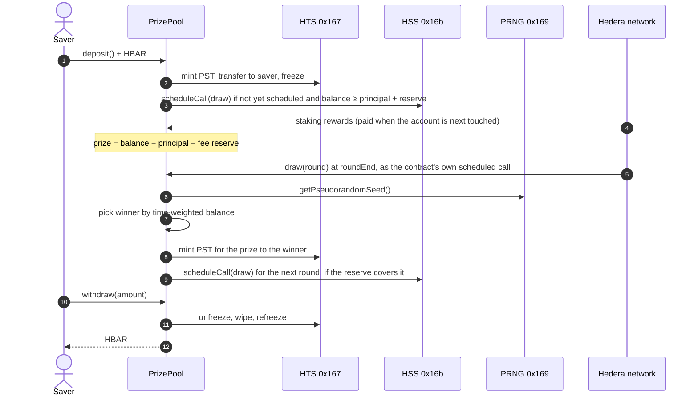

# Prize Savings: no-loss prize savings on Hedera

[](https://github.com/nickthelegend/scaffold-hbar-prize-savings/actions/workflows/ci.yaml): every push plays a full round (deposit → frozen HTS tickets → network-executed scheduled draw → PRNG winner → withdraw) on a real Hedera network.

Deposit HBAR, withdraw it whenever you like, and win the yield it earns. Principal is reserved: it is never used for
prizes or fees. Every round, the pool's **native staking rewards** (plus any sponsor boosts) go to one depositor,
picked by **Hedera's PRNG** in a draw that the contract **schedules for itself** with the **Hedera Schedule Service**.
Deposits are mirrored as **non-transferable HTS tickets**.

```bash
npm create scaffold-hbar@latest -- --template nickthelegend/scaffold-hbar-prize-savings
```

| | |
|---|---|
| Live pool (testnet) | see [Testnet proof](#testnet-proof) |
| Stack | Next.js App Router · RainbowKit/wagmi/viem · Foundry · Hiero SDK · Yarn workspaces |
| Hedera services | Staking · Schedule Service (HIP-1215) · PRNG (HIP-351) · Token Service · Mirror Node |

This is the prize-linked-savings pattern (PoolTogether, UK Premium Bonds). On most EVM chains it needs a yield
protocol, a VRF oracle and a keeper network. On Hedera all three are part of the network, which is what this template
shows you how to use.

---

## Contents

1. [Quickstart](#quickstart)
2. [Deploy your own pool](#deploy-your-own-pool)
3. [How it works](#how-it-works)
4. [Hedera services, and where they live in the code](#hedera-services-and-where-they-live-in-the-code)
5. [Project layout](#project-layout)
6. [Contract reference](#contract-reference)
7. [Costs and sizing](#costs-and-sizing)
8. [Security model and limitations](#security-model-and-limitations)
9. [Testing](#testing)
10. [Configuration](#configuration)
11. [Hedera gotchas this template handles](#hedera-gotchas-this-template-handles)
12. [Testnet proof](#testnet-proof)
13. [Working with AI agents](#working-with-ai-agents)

---

## Quickstart

### Prerequisites

| Tool | Version | Notes |
|---|---|---|
| Node.js | ≥ 20.18.3 | `node -v` |
| Yarn | 3 (bundled) | `corepack enable` once; the repo pins Yarn 3.2.3 in `.yarn/releases`. The template is Yarn-only: with npm, scaffold-hbar's install-time formatter and unpinned wagmi connectors break the build |
| Foundry | latest | `curl -L https://foundry.paradigm.xyz \| bash && foundryup` (only needed for contracts) |
| Git | any | the CLI makes an initial commit |
| Wallet | MetaMask or any EVM wallet | or use the built-in burner wallet |

### Run the app against the live testnet pool

The scaffold reads the pool address from `packages/nextjs/contracts/deployedContracts.ts`. When it holds the shared
testnet pool (see [Testnet proof](#testnet-proof)) you can use the app before deploying anything; when no pool has code
at that address on the selected chain, the app says so and shows the deploy command.

```bash
npm create scaffold-hbar@latest -- --template nickthelegend/scaffold-hbar-prize-savings
cd my-hedera-dapp
yarn next:dev            # http://localhost:3000
```

1. Connect a wallet on **Hedera Testnet** (chain id 296), or use the burner wallet.
2. Get free testnet HBAR at <https://portal.hedera.com/faucet>. Funding an EVM address also creates its Hedera account.
3. Deposit at least 10 HBAR. You receive the same amount of **PST** tickets, frozen in your account. If your account
   does not have unlimited automatic token associations, the app first asks you to associate the ticket token (once).
4. Watch the countdown. When the round ends, the network runs the draw scheduled by the contract itself. The result
   appears under **Past draws** with a HashScan link.
5. Withdraw any part of your deposit at any time.

Routes: `/` (pool), `/how-it-works` (explainer), `/debug` (every contract function), `/api/health` (JSON health check).

## Deploy your own pool

```bash
yarn foundry:test                      # ledger unit, fuzz and invariant tests
yarn foundry:account:generate          # creates a Foundry keystore; fund its address at the faucet
yarn foundry:compile
yarn foundry:deploy --network testnet  # --keystore <name> --node <id> are optional
```

`foundry:deploy` runs [`packages/foundry/scripts-js/deployPrizePool.js`](packages/foundry/scripts-js/deployPrizePool.js),
which:

1. creates the contract with **`ContractCreateFlow`**, a staking election (`setStakedNodeId`) and **no admin key**;
2. calls `initialize()` with HBAR for the HTS token-creation fee, which creates the PST ticket token and opens round 1
   (its draw is scheduled by the first deposit; an empty pool schedules nothing);
3. sends a seed with `boostPrize()` that funds the fee reserve (`keeperBuffer`), so the first deposit can schedule a
   draw;
4. writes the address and ABI to `packages/nextjs/contracts/deployedContracts.ts`, which the frontend reads.

Why not `forge script`? Only the HAPI `ContractCreate` transaction can set a staking election. A contract deployed
over JSON-RPC has none, and because this one deliberately has no admin key, it could never get one later.

Tune a deployment with env vars (in `packages/foundry/.env` or inline):

```bash
ROUND_SECONDS=21600 KEEPER_SEED_HBAR=20 yarn foundry:deploy --network testnet --node 5
```

## How it works



### Where the prize comes from

The contract holds every deposit as plain HBAR and is **staked to a consensus node**. Rewards accrue per 24-hour
staking period and are paid into the contract's balance the next time a transaction touches the account (a deposit,
withdrawal, boost or draw), after that transaction's EVM execution, with no claim call. So `prize()` never includes
`pending_reward`, and in a quiet pool rewards reach the prize a round late. Anyone can also **boost** the prize: that
HBAR earns no odds and cannot be withdrawn.

```
prize = address(this).balance − totalPrincipal − keeperBuffer
```

### The fee reserve

A scheduled draw is paid for by the contract itself (gas limit × gas price is held up front; see
[Costs](#costs-and-sizing)). So that this
never touches principal, `_scheduleDraw` only creates a schedule when there are savers **and**
`balance ≥ totalPrincipal + keeperBuffer`; otherwise it emits `DrawNotScheduled(round, reason)`. `keeperBuffer` must
cover a draw's fee (the deploy script warns below two fees). Consequences:

- An empty pool schedules nothing and pays nothing. The next deposit restarts the round and schedules its draw.
- If the surplus runs out, scheduling stops. A boost that refills the reserve schedules the round's draw, and anyone
  can `triggerDraw()` with a top-up after the grace period.
- When the last saver leaves, the draw already scheduled for that round still runs once (a rollover), then scheduling
  stops.

### Fair odds: balance × time

A saver's weight in a round is the integral of their balance over the round's seconds. Depositing 10 HBAR at the start
of a round gives twice the weight of depositing 10 HBAR halfway through, and a deposit one second before the end is
worth almost nothing. That stops anyone sniping the draw.

The contract keeps this cheap with lazy accounting (`_accrue`). Each account stores `(balance, lastUpdated, round,
weight)`, settled only when its balance changes. For an account untouched this round, the weight is simply
`balance × roundDuration`.

### The draw

`draw(round)` sums every participant's projected weight, takes `keccak256(prngSeed, round) % totalWeight`, and walks
the cumulative weights to the winner. The prize is **added to the winner's deposit** (with new tickets), not sent out,
so a draw can never fail because of a wallet. Then the next round opens and the next draw is scheduled.

`draw` only executes when the caller is the contract itself, i.e. as the schedule it created through HSS. A public draw
would let anyone call it from a contract that reverts unless it won, retrying for a fresh PRNG seed each time.

If a round has savers but no live schedule (HSS had no capacity, the reserve was short, or the scheduled call ran and
failed), **anyone** can call `triggerDraw()` once `drawOpensAt()` has passed (`roundEnd + drawGrace`, or the schedule's
second + `drawGrace`). It does not pick a winner: it schedules `draw` a few seconds out, and `msg.value` tops up the
reserve if `reserveShortfall()` says it is short. The UI shows a "Schedule draw" button in that case.

## Hedera services, and where they live in the code

| Service | What it does here | Code |
|---|---|---|
| **Staking** | Deposits earn network rewards with zero protocol risk | [`deployPrizePool.js`](packages/foundry/scripts-js/deployPrizePool.js) `setStakedNodeId` |
| **Schedule Service** (HIP-1215, `0x16b`) | The contract schedules its own next `draw()`; there's no keeper bot | [`PrizePool._scheduleDraw`](packages/foundry/contracts/PrizePool.sol) |
| **PRNG** (HIP-351, `0x169`) | Random winner from a consensus-derived seed; there's no VRF subscription | [`PrizePool.draw`](packages/foundry/contracts/PrizePool.sol) |
| **Token Service** (`0x167`) | PST ticket token: the contract holds the supply, freeze and wipe keys; holdings are frozen so they can't be transferred | [`PrizePool._createTicket` / `_issueTickets` / `_burnTickets`](packages/foundry/contracts/PrizePool.sol) |
| **Token association** (HIP-719) | UI checks whether the wallet must call `associate()` on the ticket token before its first deposit (anything short of unlimited auto-association must) | [`useTicketAssociation`](packages/nextjs/hooks/prize-savings/useTicketAssociation.ts) |
| **Mirror Node** | Draw history, staking status, schedule entities and associations, with no indexer | [`utils/prize-savings/mirror.ts`](packages/nextjs/utils/prize-savings/mirror.ts) |

## Project layout

```
packages/
├── foundry/
│   ├── contracts/
│   │   ├── PrizePool.sol                 # Hedera wiring: HTS tickets, HSS scheduling, PRNG draw
│   │   ├── PrizeLedger.sol               # pure bookkeeping: principal, rounds, time-weighted odds
│   │   └── interfaces/                   # HTS, HSS and PRNG system-contract interfaces
│   ├── scripts-js/
│   │   ├── deployPrizePool.js            # `yarn foundry:deploy`
│   │   └── lib/                          # network config + SDK deployment (shared with the e2e suite)
│   └── test/
│       ├── PrizeLedger.t.sol             # unit + fuzz tests of the ledger
│       ├── PrizeLedger.invariant.t.sol   # invariants under random sequences
│       └── e2e/prizePool.e2e.test.js     # full round on a real Hedera network
└── nextjs/
    ├── app/                              # / (pool), /how-it-works, /debug, /api/health
    ├── components/prize-savings/         # PrizeHero, SavePanel, PositionCard, DrawHistory, StakingCard
    ├── hooks/prize-savings/              # contract reads, mirror-node queries, countdown
    └── utils/prize-savings/              # unit conversion, entity ids, mirror client (+ tests)
```

## Contract reference

| Function | Who | What |
|---|---|---|
| `initialize()` payable | deployer, once | Creates the PST ticket token (the value pays the HTS fee) and opens round 1 |
| `deposit()` payable | anyone | Adds `msg.value` to your principal and mints frozen tickets (reverts if they cannot be delivered, e.g. not associated). Min `minDeposit`, max `maxParticipants` savers. Restarts an ended empty round; schedules the round's draw if none was |
| `withdraw(uint256)` | saver | Returns principal at any time and burns tickets. A failed ticket operation is logged, never blocks the HBAR |
| `boostPrize()` payable / `receive()` | anyone | Adds to the prize without odds; schedules the round's draw if this refills the reserve |
| `triggerDraw()` payable | anyone, after `drawOpensAt()` | Schedules the draw of a round with no live schedule; `msg.value` tops up the reserve |
| `draw(uint256 round)` | the contract's own HSS schedule only | Picks the winner or rolls over, opens the next round, schedules the next draw |
| `prize()` view | | Current prize in tinybars |
| `reserveShortfall()` view | | HBAR the balance lacks to cover principal + reserve (0 when a draw can be scheduled) |
| `drawOpensAt()` view | | When `triggerDraw` opens for the current round |
| `nextDrawSchedule`, `scheduledRound`, `scheduledFor` | | Latest schedule entity, and the round and second it was created for |
| `accountOf(address)` view | | `(balance, projectedWeight)` |
| `oddsOf(address)` view | | `(userWeight, totalWeight)` projected to the round's end |

Events: `Deposited`, `Withdrawn`, `PrizeBoosted`, `DrawExecuted(round, winner, prize, seed, participants)`,
`RoundRolledOver`, `DrawScheduled(round, schedule, expirySecond)`, `DrawNotScheduled(round, reason)` (no savers,
reserve short, no capacity), `ScheduleFailed(round, responseCode)` (HSS refused; −1 when no code came back),
`TicketSyncFailed(account, op, responseCode)`.
All amounts are **tinybars** (see [gotchas](#hedera-gotchas-this-template-handles)).

## Costs and sizing

Gas measured by `yarn foundry:test:e2e` on a Hiero Local Node (gas price 71 tinybar/gas there; the suite prints these
numbers on every CI run). System-contract calls are priced from their HAPI fees, so they dominate:

| Call | Gas used | What costs |
|---|---|---|
| `scheduleCall` (HSS) | ≈ 1.41M | Constant, whatever the scheduled call's gas limit. `hasScheduleCapacity` ≈ 2.6k |
| HTS transfer that auto-associates the ticket | ≈ 721k | A saver's first ticket. Every other HTS call (mint, transfer to an associated account, freeze, unfreeze, wipe) ≈ 15k |
| `deposit`, existing saver | ≈ 143k | |
| `deposit`, new saver | ≈ 879k | Includes the auto-association |
| `deposit` that schedules the draw | ≈ 2.40M | First saver of a round: new saver + `scheduleCall` |
| `withdraw` | ≈ 92k (full) – 129k (partial) | |
| `boostPrize` | ≈ 30k | + ≈ 1.41M when it schedules the draw |
| `triggerDraw` | ≈ 1.53M | |
| `associate()` (HIP-719) | ≈ 729k | Only for accounts without unlimited auto-association |
| Scheduled `draw` | ≈ 1.60M with 1–2 savers | 4 HTS calls and PRNG (≈ 15k each), `scheduleCall` for the next round (≈ 1.41M), plus the saver scan |
| Saver scan in `draw` | ≈ 0.87M at 100 savers | `PrizeLedgerScanGasTest` bounds it |

**`DRAW_GAS_LIMIT` (default 3M)** ≥ a 2-saver draw (≈ 1.60M) + the 100-saver scan (≈ 0.87M) ≈ 2.47M, plus ~20% margin. If you raise
`MAX_PARTICIPANTS`, raise it by ≈ 9k gas per extra saver. It is immutable, and a draw that runs out of gas waits for
`triggerDraw`.

**Who pays.** The scheduled draw is paid by the pool: the payer is charged gas limit × gas price up front and refunded
what the call did not use. Inside `draw` the up-front charge is already missing from the balance, so the prize is
smaller by exactly that amount and the refund becomes part of the next prize (the e2e suite asserts this). On the
local node a draw with the default 3M limit used 1.60M gas and cost the pool a net 1.14 HBAR (gas used × price). Scheduling done by a deposit, boost or `triggerDraw` is paid
by that transaction's sender, which is why the frontend gives those calls extra gas only when they will schedule
(`utils/prize-savings/gas.ts`).

**Fee reserve.** `KEEPER_BUFFER_HBAR` (default 5) must cover the up-front charge of a draw, `DRAW_GAS_LIMIT` × gas
price (≈ 2.1 HBAR at 3M and 71 tinybar/gas); the deploy script warns below twice that.

**Deployment.** `ContractCreateFlow` ≈ 3.7M gas. `initialize` ≈ 259k gas plus `TICKET_FEE_HBAR` (default 15) for the
HTS token-creation fee (about $1); none of that value comes back to the pool, so it is not part of the reserve.

**Round length.** Staking rewards accrue per 24-hour period, so rounds shorter than a day mostly roll over and spend
fees. The default is 24 hours; the public testnet demo uses shorter rounds so visitors can watch draws happen.
Testnet pays about 0.19% a year in staking rewards (`/api/v1/network/stake`), so testnet prizes come mostly from
boosts. Mainnet rates are higher.

## Security model and limitations

- **No owner.** No admin key, no `onlyOwner`, no pause. After `initialize`, nobody can change parameters or touch
  principal. Deposits leave the contract only through `withdraw` to their owner.
- **No external protocol risk.** Principal is native HBAR in the contract, not lent to or swapped through any protocol.
- **Principal is reserved.** Prizes are only what is above `totalPrincipal + keeperBuffer`, and draw fees come out of
  that reserve: a draw is scheduled only while the balance covers principal plus the reserve, and an empty pool
  schedules nothing. The end-to-end suite checks `balance ≥ totalPrincipal` after a real scheduled draw has paid its
  fee. This relies on `keeperBuffer` exceeding a draw's fee; keep it at two fees or more (a stale schedule plus a
  draw), which the deploy script checks against the live gas price.
- **No re-rolls.** `draw` runs only as the contract's scheduled call, and `triggerDraw` only schedules one, so no
  caller can revert the transaction that reads the PRNG.
- **Tickets never hold principal hostage.** The ledger is the source of truth. On the draw and withdraw paths a
  failed HTS call (for example a saver who enabled `receiverSigRequired`) emits `TicketSyncFailed` and the draw or
  withdrawal completes; tickets can then drift from principal for that account. A deposit still reverts if its
  tickets cannot be delivered, so the saver can associate and retry and new principal always starts in sync.
- **Ledger invariants.** Σ balances = `totalPrincipal` and participants = holders are fuzzed in
  `PrizeLedger.invariant.t.sol`.
- **Reentrancy.** All state-changing entry points are `nonReentrant`, and `withdraw` updates the ledger and burns
  tickets before sending HBAR (checks-effects-interactions).
- **Randomness.** PRNG output can't be predicted before consensus, but it is not a VRF. Fine for small prizes; for
  large ones, add commit-reveal or a VRF provider.
- **Participant cap.** `draw()` is O(savers), so `maxParticipants` (default 100) keeps it inside `DRAW_GAS_LIMIT`.
  The cap can be griefed: an attacker who fills every slot locks out new savers. `MIN_DEPOSIT_HBAR` (default 10) makes
  that cost at least 1,000 HBAR of locked (refundable) capital plus fees. Raising the minimum makes the attack dearer
  but excludes small savers; raising the cap needs more draw gas. For thousands of savers, replace the scan with a
  sortition sum tree.
- **Draw gas.** If a draw ever needs more than `DRAW_GAS_LIMIT`, the scheduled call fails and the round waits for
  `triggerDraw`, which schedules the same gas limit again. Size it from the measurements below with margin; it is
  immutable.
- **Staking rewards** are paid by the network's reward account and may vary or pause. The pool degrades gracefully:
  rounds roll over until there is a prize, and stop being scheduled when the reserve runs out.

## Testing

No simulated system contracts anywhere: logic that doesn't touch Hedera is tested in isolation, and everything
that does is tested on a real Hedera network.

| Layer | Command | What it proves |
|---|---|---|
| Ledger unit + fuzz | `yarn foundry:test` | Principal accounting, participant cap, swap-and-pop, time-weighted odds, winner selection matches odds over 2,000 draws, gas bound of the 100-saver scan |
| Ledger invariants | `yarn foundry:test` | 256 runs × 500 random calls: Σ balances = principal, participants = holders, untouched savers weigh exactly `balance × round` |
| Frontend | `yarn next:test` | Tinybar/weibar conversion, entity ids, draw-status states, association rule, log decoding; live testnet mirror-node pagination |
| **End-to-end** | `yarn foundry:test:e2e` | Two staked pools with rounds of seconds. Pool 1: empty pool schedules nothing, first deposit schedules the draw, frozen 1:1 tickets, refused ticket transfer, `draw` from a saver reverts (`OnlyScheduled`), `prize()` = balance − principal − reserve, the **network-executed** HSS draw (run by the contract itself) pays its fee from the surplus and credits the winner, withdrawals move the pool balance by exactly the amount, an emptied pool stops scheduling and paying. Pool 2: short reserve schedules nothing, deposit without association reverts until HIP-719 `associate()`, `triggerDraw` timing, top-up and one-schedule-per-round, triggered draw picks the winner in a scheduled call. Prints gas per entry point |

`PrizePool` is split so this works: `PrizeLedger` holds all the bookkeeping and calls nothing, so Foundry can test
it directly. `PrizePool` only adds the HTS, HSS and PRNG calls, which only exist on Hedera.

### Running the end-to-end suite

Against a [Hiero Local Node](https://github.com/hiero-ledger/hiero-local-node) (Docker, prefunded accounts, real
system contracts):

```bash
npx @hashgraph/hedera-local start -d     # consensus node + mirror node + JSON-RPC relay
yarn foundry:compile && yarn foundry:test:e2e
```

Against testnet (needs an ECDSA operator with about 300 HBAR: two deployments and ticket tokens, three funded savers,
reserve top-ups):

```bash
E2E_NETWORK=testnet HEDERA_OPERATOR_ID=0.0.x HEDERA_OPERATOR_KEY=0x... yarn foundry:test:e2e
```

CI runs the unit tests, lint, types and build on every push, then the end-to-end suite on a local node
(`.github/workflows/ci.yaml`).

### Local development network

`yarn foundry:deploy --network local` deploys to a running local node (genesis operator, no faucet needed), and
`NEXT_PUBLIC_HEDERA_NETWORK=local yarn next:dev` points the frontend at it (chain 298, mirror node on
`localhost:5551`).

## Configuration

| Variable | Where | Default | Purpose |
|---|---|---|---|
| `ETH_KEYSTORE_ACCOUNT` | `packages/foundry/.env` | prompt | Keystore used by `foundry:deploy` |
| `DEPLOYER_KEYSTORE_PASSWORD` | shell | prompt | Non-interactive deploys (CI) |
| `ROUND_SECONDS` | deploy env | `86400` | Round length |
| `DRAW_GRACE_SECONDS` | deploy env | `600` | Delay before anyone may `triggerDraw` a round with no live schedule |
| `KEEPER_BUFFER_HBAR` | deploy env | `5` | Fee reserve above principal; a draw is only scheduled while the balance covers it. Keep ≥ 2 draw fees |
| `MIN_DEPOSIT_HBAR` | deploy env | `10` | Minimum deposit; sets the cost of filling every participant slot |
| `MAX_PARTICIPANTS` | deploy env | `100` | Cap that bounds draw gas |
| `DRAW_GAS_LIMIT` | deploy env | `3000000` | Gas for each scheduled draw; sized for 100 savers (see Costs) |
| `TICKET_FEE_HBAR` | deploy env | `15` | Value sent to `initialize` for the HTS creation fee (not returned to the pool) |
| `KEEPER_SEED_HBAR` | deploy env | `10` | Initial boost that funds the fee reserve (must be ≥ `KEEPER_BUFFER_HBAR` minus what `initialize` leaves, or the first draw waits for a boost) |
| `NEXT_PUBLIC_HEDERA_TESTNET_RPC_URL` | `packages/nextjs/.env.local` | Hashio | JSON-RPC endpoint |
| `NEXT_PUBLIC_WALLET_CONNECT_PROJECT_ID` | `packages/nextjs/.env.local` | demo id | WalletConnect |
| `NEXT_PUBLIC_HEDERA_NETWORK` | `packages/nextjs/.env.local` | `testnet` | `local` targets a Hiero Local Node |
| `E2E_NETWORK` | shell | `local` | Network for `foundry:test:e2e` (`local` or `testnet`) |

No secret is read by the frontend. Never commit `.env` files; they are git-ignored.

## Hedera gotchas this template handles

1. **Two HBAR units.** Inside contracts, `msg.value` and balances are **tinybars (8 decimals)**. Over JSON-RPC,
   wallets send **weibars (18 decimals)**. The frontend sends `parseEther(amount)` as `value` and formats contract reads
   with 8 decimals ([`units.ts`](packages/nextjs/utils/prize-savings/units.ts)).
2. **Staking elections need HAPI.** See [Deploy your own pool](#deploy-your-own-pool).
3. **Token association.** An account must be associated with an HTS token before receiving it. EVM-alias accounts
   usually auto-associate. If not, the UI offers a one-click `associate()` (HIP-719) before the first deposit.
4. **Wiping frozen holdings fails** (`ACCOUNT_FROZEN_FOR_TOKEN`), so `withdraw` unfreezes, wipes and refreezes.
5. **Scheduled-call capacity is per second.** `_scheduleDraw` checks `hasScheduleCapacity` and tries the next few
   seconds before giving up gracefully (`DrawNotScheduled(round, NoCapacity)`).
6. **Scheduled calls run when the network is busy.** A long-term schedule executes when a transaction reaches
   consensus at or after its expiry second. That's instant on testnet and mainnet. On an idle local node the e2e
   suite sends a 1-tinybar heartbeat transfer while it waits.
7. **Mirror-node topic filters need a timestamp range** (at most 7 days). The UI walks `links.next` instead, decodes
   with the ABI and keeps only draw events, so busy pools don't push draws out of a single page.
8. **System-contract results can be short.** On a chain without HSS at `0x16b` a call "succeeds" with empty data;
   `_scheduleDraw` checks lengths before decoding and reports `ScheduleFailed` instead of reverting.
9. **Savers need an association, or unlimited slots.** The mirror node reports an account's auto-association limit but
   not how many slots are used, so the UI only skips `associate()` for unlimited (-1) accounts.
10. **Gas estimates for HTS-heavy calls.** The frontend sends explicit gas limits sized from the end-to-end
    measurements (`utils/prize-savings/gas.ts`) with ~25% margin, and add the ≈ 1.41M for `scheduleCall` only when
    the call will schedule the draw, since Hedera can bill a large share of an unused limit.
11. **Fork tests can't exercise Hedera services.** A Foundry fork runs in a local EVM, where `0x167`, `0x16b` and
    `0x169` don't exist, and Hashio returns runtime bytecode with immutables zeroed. This template tests Hedera
    behaviour on a real network (local node or testnet) instead.

## Testnet proof

<!-- PROOF:START -->
Deployment pending.
<!-- PROOF:END -->

## Working with AI agents

- [`AGENTS.md`](AGENTS.md) briefs coding agents (Claude Code, Cursor, Codex) on this template: invariants to keep,
  commands, and how to extend it safely.
- [`.harness/`](.harness/) contains a [Hedera Harness](https://github.com/hedera-dev/hedera-harness) recipe with
  validators (static checks, build, route smoke tests, on-chain deposit/withdraw), so an agent can build features on
  top of this template and have them verified.

## License

MIT. See [LICENCE](LICENCE). Built on [Scaffold-HBAR](https://github.com/hedera-dev/scaffold-hbar).
